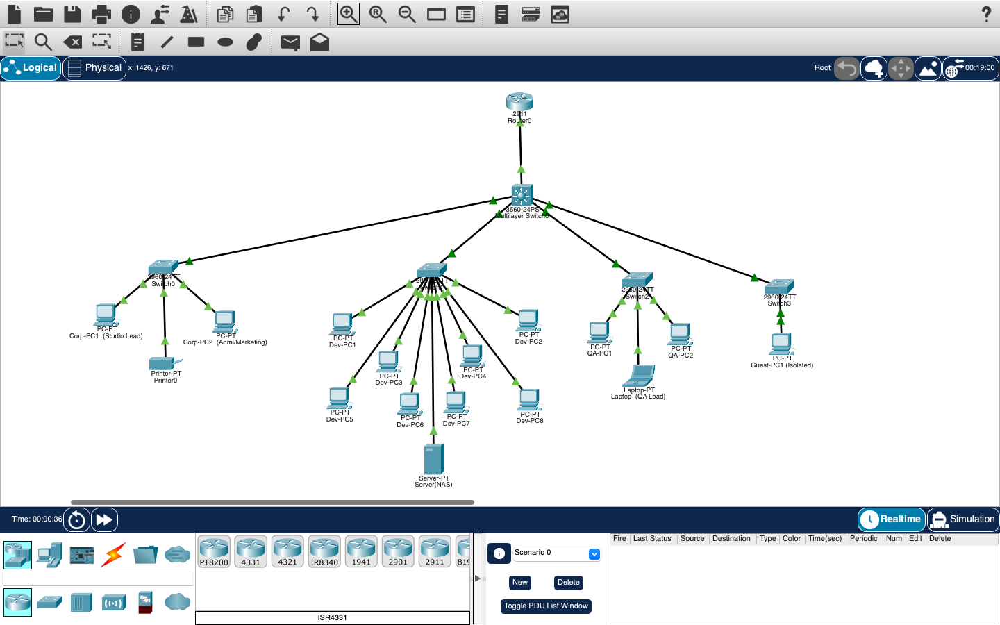

# Network Design for a Small Gaming Studio (Cisco Packet Tracer)

I built this to practice designing and configuring a small business network from scratch: VLANs, inter-VLAN routing, DHCP, and access control, all done in Packet Tracer and verified with real CLI output instead of just claiming it works.

## The scenario

A 15-person indie gaming studio needs its office network set up. Developers, 3D artists, QA testers, and admin/marketing staff, plus a guest Wi-Fi that should not be able to touch anything internal.

## Topology

Router0 connects out to the edge. Below it sits a Multilayer Switch handling VLAN routing, DHCP, and the guest isolation ACL. Four access switches hang off that, one per VLAN, with end devices under each.

| VLAN | Name | What's on it |
|---|---|---|
| 10 | CORP | Studio lead and admin/marketing PCs, shared printer |
| 20 | DEV_ART | Developer and 3D artist workstations, shared NAS |
| 30 | QA_TEST | QA tester PCs and the QA lead's laptop |
| 90 | Guest | Isolated guest Wi-Fi, no access to anything internal |

## Verification

I didn't just want to say "it works," so here's the actual CLI and command prompt output from the build, in `/screenshots`:

- **vlan-trunk-dhcp-acl-verification.png**: `show vlan brief` and `show interfaces trunk` on the Multilayer Switch, confirming all 4 VLANs are active and every trunk link is up. Same screenshot also has the guest isolation ACL and `show ip dhcp binding`, which lists 15 real DHCP leases with unique MAC addresses.
- **ping-and-traceroute-inter-vlan.png**: a ping between two Dev PCs on the same VLAN (0% loss), a ping from a Dev PC to a QA PC across VLANs (also 0% loss), and a traceroute showing the hop through 10.10.20.1, the Multilayer Switch's VLAN 20 gateway, before it reaches the QA PC.
- **ping-guest-blocked.png**: a ping from the guest PC to a Corp PC. 100% packet loss, which is exactly what the isolation ACL is supposed to do.
- **router-connectivity-verification.png**: `show ip interface brief` on Router0 plus a ping from the router out to the Multilayer Switch, showing there's an actual working path to the edge and not just VLAN-to-VLAN routing floating in isolation.

## Why I set it up this way

VLAN segmentation keeps QA devices, dev/art workstations, and admin machines off each other's broadcast domain, so a problem on one segment doesn't spill into the others, and guest traffic is fully boxed in. Trunk ports carry all 4 VLANs between the Multilayer Switch and each access switch, with the uplink on the same port across all four for consistency. I used DHCP instead of static IPs for end devices so the network manages its own addressing instead of me hardcoding everything by hand. The ACL only blocks guest-to-internal traffic, so guests can still reach the internet, which is how most real guest networks are set up anyway.

## A few things I ran into

- Leaving a port in `switchport access vlan X` mode on one end of a trunk link throws `%CDP-4-NATIVE_VLAN_MISMATCH` and `%SPANTREE-2-BLOCK_PVID_LOCAL` errors. Fixed by explicitly setting `switchport mode trunk` on both ends.
- 2960 switches only do 802.1Q trunk encapsulation, so trying to set anything else just returns `% Invalid input`. Expected, not a bug.
- `do show cdp neighbors` only works from config mode. At the plain `Switch>` prompt you have to drop the `do`.

## What's in here

- `Device_Inventory.xlsx`: every device tracked (22 total), with VLAN, IP scheme, and MAC addresses, plus a summary tab that recalculates off the main list
- `Incident-Runbook.md`: how I'd triage a "can't reach the network" ticket for this setup
- `topology-final.png`: the full diagram as built
- `screenshots/`: the four verification screenshots above
- the `.pkt` file: open it directly in Packet Tracer to see every device's live config yourself

